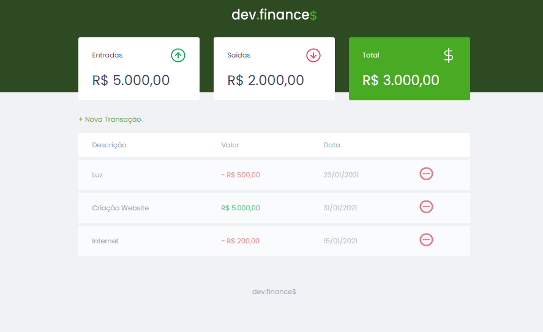

# dev.finance 💲

Projeto de controle de finanças do curso da Rocketseat.

Feito em HTML, CSS e JavaScript.
 
 
 

Contém formulário, botões interativos e responsividade.

Link para o site: https://gabimesquita.github.io/dev.finance/

 

<h2>Como usar?</h2>

1. Clique no botão + Nova Transação.

2. Na janela, insira a descrição do produto (ex.: Água), o valor (colocar sinal de negativo quando sor saída), e a data.

3. Clique em Salvar para a informação ficar salva na tabela principal e entrar na conta de entradas, saídas, e total.

4. Ao final, você terá um controle de finanças estilo carteira digital.

5. Para tirar o ítem, clique no sinal de - (menos) em vermelho no fim da linha.

<h2>Licença</h2>

MIT (Massachusetts Institute of Technology)

 
